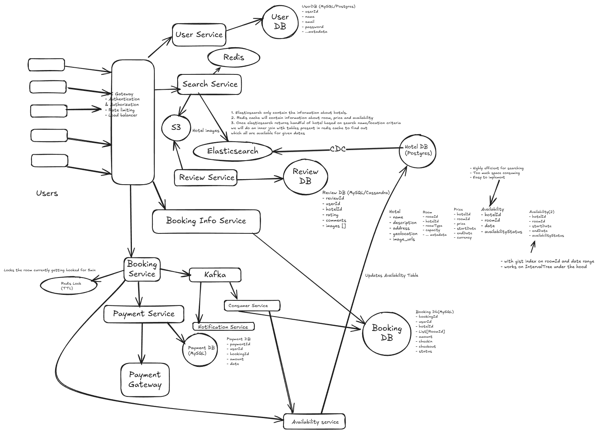

# Functional Requirement
1. User should be to create account in our application.
2. User should be able to search hotel based on name and location.
3. User should be able to book a room in a particular hotel based on availability.
4. User should be able to make the payment and confirm the booking.
5. View post booking details on their profile.

# Non Functional Requirement
1. Scale: 50M user & 10M hotels
2. CAP Theorem:
    - Search: Highly Available
    - Booking: Highly consistent

# Identify Core Entity
1. User
2. Hotel
3. Room
4. Booking
5. Payment

# API Designing
1. POST: /v1/user/registry {postBody: userMetadata} + (login/logout/update)
2. GET: /v1/hotels/search?q={name}&l={location}&d={date} -> List[HotelId(partial data)] : pagination
3. GET: /v1/hotels/{hotelId}/{date} -> Hotel Metadata (available rooms, review, ...) {json}
4. POST: /v1/booking {postBody: hotelId, date, roomId[]} -> Return BookId

# High Level Design

# Low Level Design

1. Search Service: To choose DB, we will go for Elasticsearch for searching and postgres for storing.
    In postgres we will store:
        - Hotel
        - Rooms
        - Price
        - Avaialability (with gist index on roomId and date range)
    
    Efficient Searching:
    1. Elasticsearch only contain the information about hotels.
    2. Redis cache will contain information about room, price and availability.
    3. Once elasticsearch returns handful of hotel based on search name/location criteria
    we will do an inner join with tables present in redis cache to find out 
    which all are available for given dates