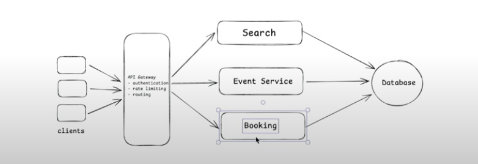
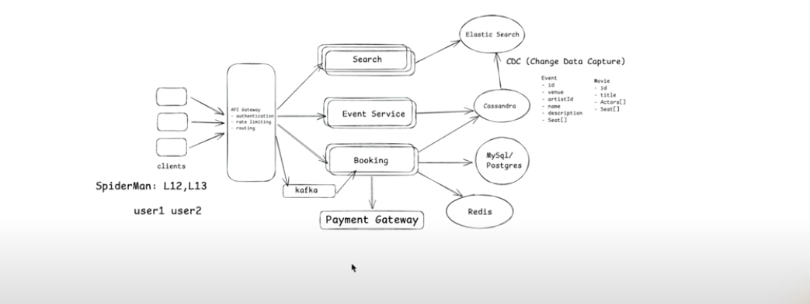

# Functional Requirements
1. User should be able to search an event based on some title, location or dates.
2. User should be able to view the details of the event. (Seat, Description, metadata)
3. User should be able to book a ticket for that event.

# NoN Functional System
1. Scale: 100MAU
2. CAP Theorem:
    - Search and View should be highly available.
    - Booking should be highly consistent.

# Identify Core Entity:
1. User
2. Events (Movie/Concert)
3. Venue (Hall/Location)
4. Ticket

# API Designing
1. GET: /v1/events/search/q={searchTerm}&location={location}&date={date} -> List[EventID] : pagination
2. GET: /v1/events/{eventID} -> Event details, location and seats[]
3. Booking is a 2 step process
    - POST: /v1/booking/reserve
            {
                List[seats]
            } -> bookingId
    - POST: /v1/booking/confirm
            {
                bookingId
                paymentDetails
            } -> TicketID

# High Level Design

# Low Level Design
- Information should be highly consistent: MySQL/Postgres
- Storing Metadata/ Highly available things: Cassandra (Highly write optimized)
- Highly Optimized Search: Elasticsearch

All metadata are ideally stored in Cassandra. To ingest data into Elasticsearch for handling search functionality 
we need to have a cron job or a CDC pipeline. What CDC pipeline will do is, whenever there is a change in our NoSQL database,
an event will be triggered to update that in our Elasticsearch.

