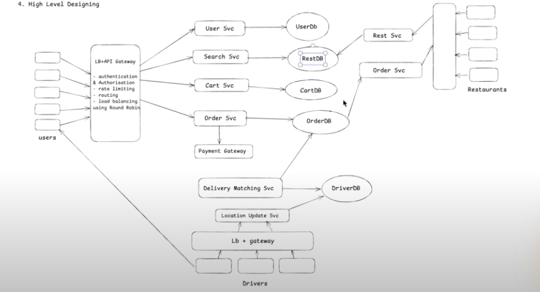

# Functional Requirement
1. User should be able to create an account in our application.
2. List down all nearby restaurants based on user's location
3. User should be able to search restaurent based on user location.
4. Show the list of the menu that are available at a particular restaurant.
5. User should be able to select various items in the cart and make the payment to confirm order.
6. Once the restaurent accepts, find nearby delivery partner based on driver location, optimised delivery time.
7. Once the partner pickup the order, give almost realtime location of the delivery partner to the user.
8. User should get notification at all stages and get past orders in their profile.

# Non functional Requirement
1. Scale: 50M User, Restaurent 1M
2. CAP Theorem:
    - Search: Highly available
    - Payment & Order: Highly consistent

# Identify Core Entity
1. User
2. Restaurents
3. Food Menu
4. Delivery Agents
5. Payments

# API Designing
1. POST: /v1/user/register {postBody: userMetadata} + (login/logout/update)
2. GET: /v1/restaurants/nearby?lat={lat}&lng={lng}&rad={rad} -> List[RestaurentId(partial)] : pagination
3. GET: /v1/restaurants/search?title={title}&menuItem={item} -> List[RestaurentId(partial)] : pagination
4.  1. GET: /v1/restaurants/{restaurantId} -> Restaurant Metadata in JSON
    2. GET: /v1/restaurants/{restaurantId}/menu -> List[FoodItem]: pagination
5.  1. POST: /v1/restaurants/{restaurantId} {postBody: FoodId + Quantity + restaurantId} + (update/delete)-> cartId
    2. POST: /v1/orders {postBody: cartId} -> orderId
    3. POST: /v1/payments {postBody: orderId + paymentMetadata} -> paymentId
6. GET: /v1/delivery/{orderId}/tracking -> Status 

# High Level Design

# Low Level Design

