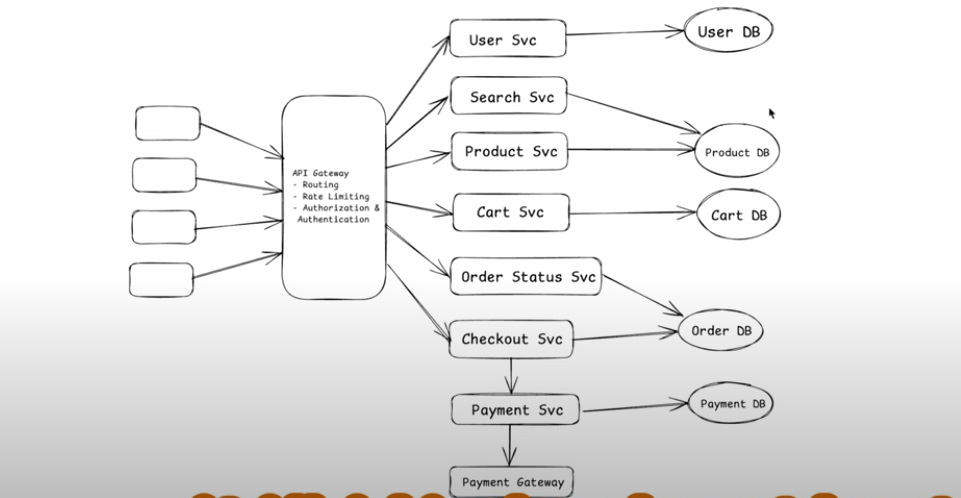
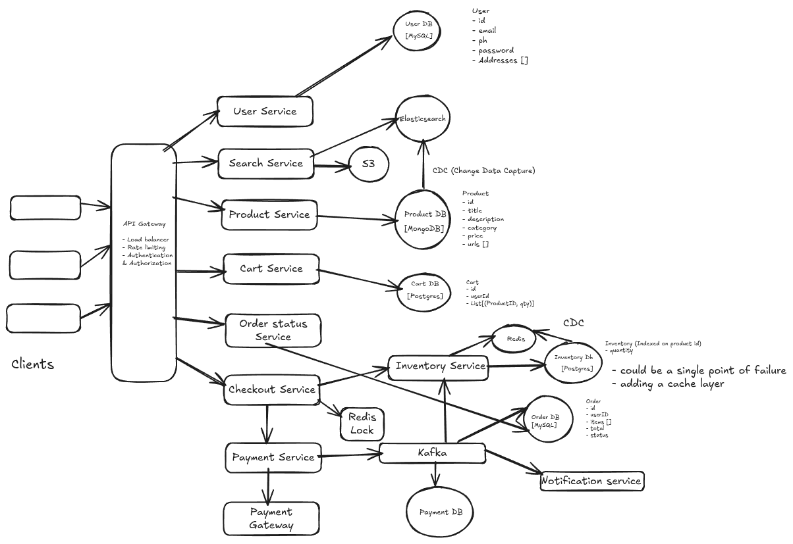

# Functional Requirements

1. User should be able to search and find product based on product name or title.
2. User should be able to view the details of the product: name, price, rating, review
3. User should be able to select the quantity and movit them to cart.
4. User should be able to make the payment and do the checkout
5. User should be able to track the order status
6. Manage purchase of items having limited stock.

# Non Functional Requirements

1. Scale: 10 MAU and 10orders/sec
2. CAP Theorem: 
    - Highly Available in searching
    - Highly consistent in placing order & Inventory Management
3. Latency: ~200ms

# Identify Core Components

1. User
2. Product
3. Cart
4. Order
5. Checkout

# API Designing

1. GET: /v1/product/search?q={searchItem} -> List[productID] : pagination
2. GET: /v1/product/{productID} -> Product Details In JSON
3. POST: /v1/cart/add/{post body: List[ProductID]} -> CartID
4. Booking is a 2 step process:
    - POST: /v1/checkout/{post body: List[Product(id, qty, price)]} -> OrderID
    - POST: /v1/payment/{post body: OrderID & Payment Details} -> Confirmation/Reject
6. GET: /v1/status/{orderID} -> Status Of the Order

# High Level Design

# Low Level Design

