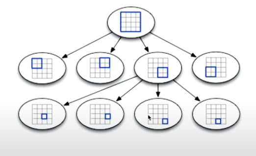
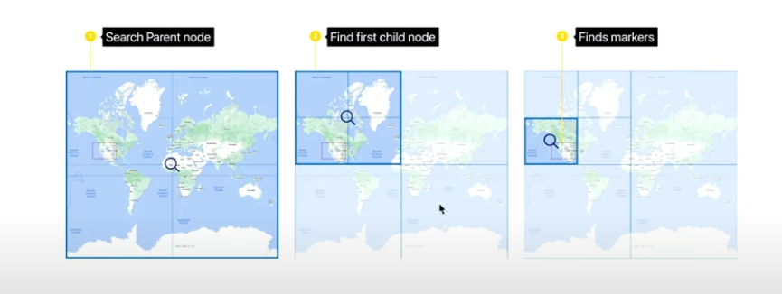
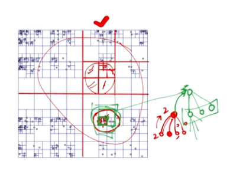
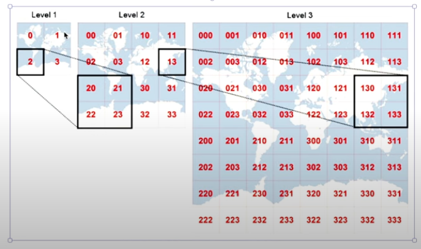
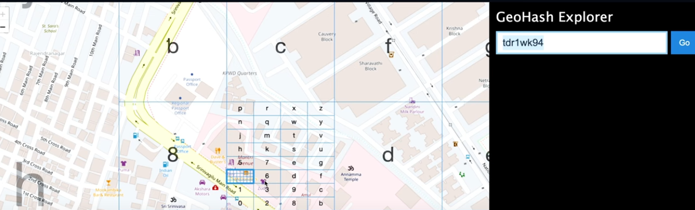
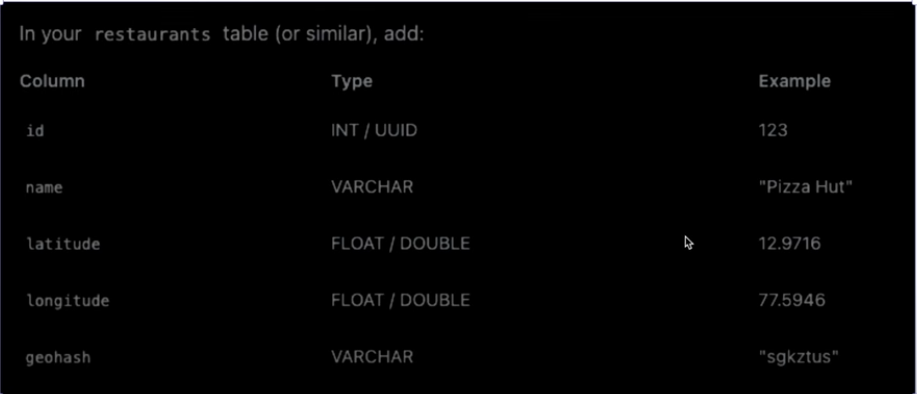
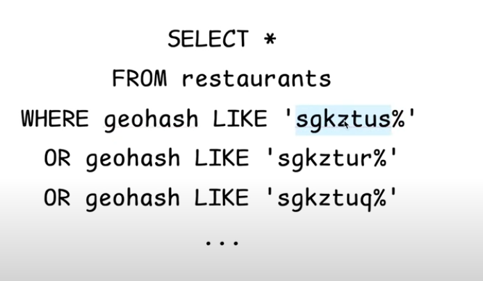
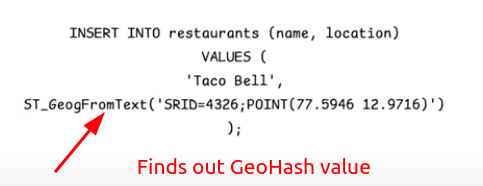
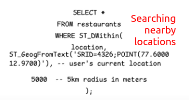

# Design Proximity Search Algorithm / Best Proximity Search Algorithm
- Find nearby hotels / drivers / restaurants

## 1. Quad Tree

Consider the entire world map is divided into 4 quadrants. Again a particular quadrant is divided into 4 sub quadrants. In this way to continue dividing each area into 4 sub areas until we reach a particular area/datapoint. A single leaf node can be a single restaurant or a group of restaturant that are located quite nearby. So it is easily understandable that if we are representing the entire world map as the root node, then how many of levels we need to reach a particular area (a single/ a group of restaturants) denoted by a leaf node.

Cons:
1. Quad Tree at a global level is not properly height balanced. Because obviously, the restaurants are not scattered in the world map uniformly.
    - Hence we need to perform the tedius job in finding nearby restaurants of a quad by recursively checking all the children of its parent again and again until its in radius of X km.

2. Quad Tree is not a Database but a data structure. So we need auxiliary space to have this quad tree (A HUGE SIZE) in memory. Also whenever a new restaurant is added, we need to build the quadtree again.

## 2. Geo Hash

- More or less similar like quad tree.
- Sub divide entire world map into 4 quad tree.
- To represent the integers, we use base64 encoding.

- To find out neighbouring location, we just need to change the last bit.

Schema Structure:

- To find nearby restaurant location, we can simply have a SQL query like

## 3. Postgres with GIS Extension
- GIS Extension we need to install on top of our database, to get the benefit of geohashing and searching by default by the database.

- Searching nearby locations are as simple as writing a SQL query for it.

## 4. Elastic Search
- Comes with geo location searching

# Which one to use?
- Quad Tree: Complex & Not scalable; Avoid
- GeoHash: If only need location based search
- Postgres with GIS (+ fuzzystrmatch extension): Location + Text based search
- Elastic Search (buitin support with geohash & fuzzy search): Location + Text based search

