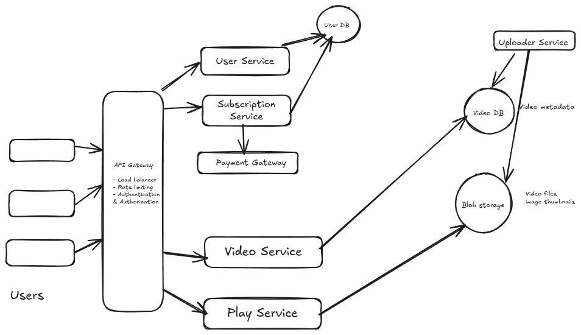
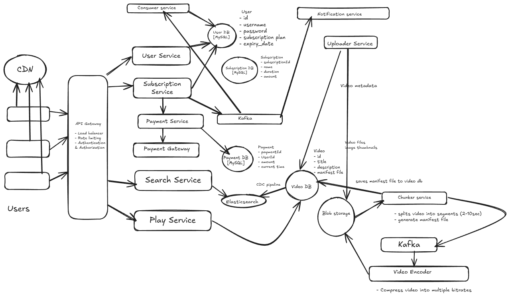

# Functional Requirements
1. User should be able to create account and opt for subscription.
2. User should be able to search for movies/shows based on title
3. User can watch video in any resolution (480p, 720p, 1080p, 4k etc)

# Non Functional Requirements
1. Scale: 200M user & 10k Videos (~1hr each)
2. CAP Theorem: High availability
3. Latency: User should be able tyo watch the video with zero or negligible buffering

# Identify Core Entity
1. User
2. User Metadata
3. Video
4. Video Metadata (Static Images + Description)

# API Design
1. POST: /v1/user/register + (login/logout/update)
2. GET: /v1/subscription/plans -> All subscription plans
3. POST: /v1/subscription {postbody: user metadata + subscriptionId}
4. GET: /v1/videos/search/q={name} -> List[Video(Id, name, thumbnail, description)] : pagination
5. GET: /v1/videos/{videoId} -> Return video metadata {json}
6. GET: /v1/videos/play/{videoId} -> Start the video

# High Level Design

# Low Level Design

When a video is uploaded to s3 by backend team, chunker service gets called. The job of this chunker service is to split the entire video into multiple segments of 2-10sec and generate a manifest file which stores the linking of one segment to another. Chunker service then saves the manifest file to video Db.
Next it publish an event to kafka for other services to do further processing. One is video encoder which compress the video in multiple bitrates and store it to s3.

To play a video client first hits the video db through load balancers and services and gets the manifest file. Now based on user's bandwidth
it decides the bitrates and requests segment based on that. When a particular segment is playing, in the midway client recalculates the bandwidth and
request segment (higher/lower/same) based on that. Also to optimize the the entire flow, popular videos are mostly stored in local cdns, hence user doesnt need to hit the actual s3 again and again going through loadbalancers and stuffs.