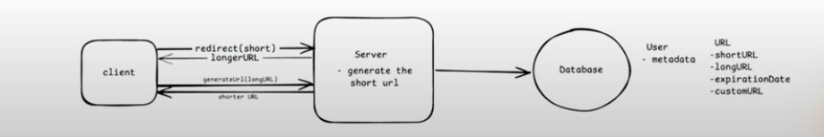
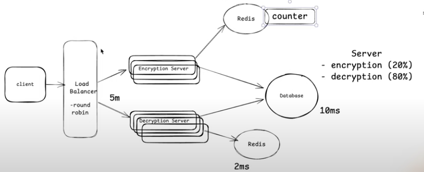

# Functional Requirement
1. Create a short URL from a long URL
    - Optional: Support custom URL
    - Optional: Support expiration date
2. User should be redirected to the original URL from the shortened URL.

# Non Functional Requirement
1. Latency: 200ms -> URL creating + Redirecting
2. Scale: 100M DAU, 1B URL
3. CAP Theorem: Highly Available, Eventual Consistency

# Identify Core Entity
1. URL
2. User

# API Designing
1. POST: /v1/url {postBody: longURL, customUrl? expiry date?} -> shortURL
2. GET: /v1/url/{shortURL} -> longURL

# High Level Design

# Low Level Design

Above is a counter based approach. But we use a local we might end up with having duplicates siince in microservice architecture all server will have their own counter value. To solve this we can introduce a gloabl counter managed by Redis. But Redis can be a single point of failure, so we might need a Redis cluster. And in redis cluster, it might still fail with having duplicates since different Redis have their different counter value.

## Zookeeper
Zookeeper is a distributed open source coordination service for distributed applications, providing centralized services for configuration management, naming, synchronization and group services, making it easier to manage large clusters.

Used For: Maintaining configuration information, naming, providing distributed synchronization, distributed locking, group services etc.